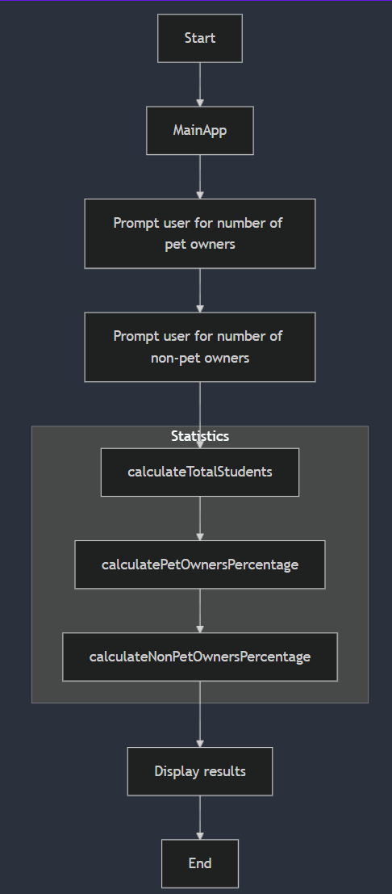
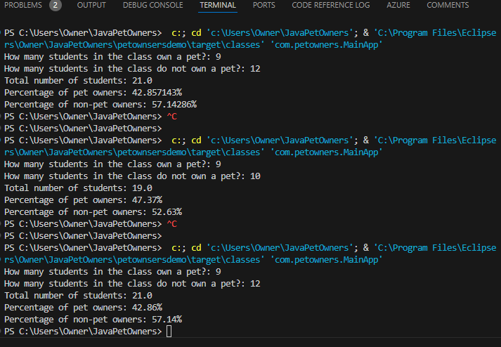

# Synopsis

The application is a simple Java program that calculates the total number of students, the percentage of pet owners, and the percentage of non-pet owners based on user input.

# Structures

The `MainApp` class, located in -> [MainApp.java](src/main/java/com/petowners/MainApp.java), serves as the entry point of the application. It initializes the application and contains the `main` method which starts the execution of the program. The `MainApp` class typically handles the setup and coordination of various components within the application.

The `Statistics` class  located in -> [Statistics.java](src/main/java/com/petowners/Statistics.java), contains three methods:
- `calculateTotalStudents(int numberOfPetOwners, int numberOfNonPetOwners)`: Calculates the total number of students by adding the number of pet owners and non-pet owners.
- `calculatePetOwnersPercentage(int numberOfPetOwners, float totalStudents)`: Calculates the percentage of pet owners by dividing the number of pet owners by the total number of students and multiplying by 100.
- `calculateNonPetOwnersPercentage(int numberOfNonPetOwners, float totalStudents)`: Calculates the percentage of non-pet owners by dividing the number of non-pet owners by the total number of students and multiplying by 100.

# Usage

The application prompts the user to enter the number of students who own a pet and the number of students who do not own a pet. It then calls the methods in the `Statistics` class to calculate the total number of students and the percentages of pet owners and non-pet owners. The results are printed to the console.

```
Statistics
├── calculateTotalStudents
├── calculatePetOwnersPercentage
└── calculateNonPetOwnersPercentage
MainApp
└── main
```

## Flowchart



## Result display



# Author
Harry Joseph October 03, 2024